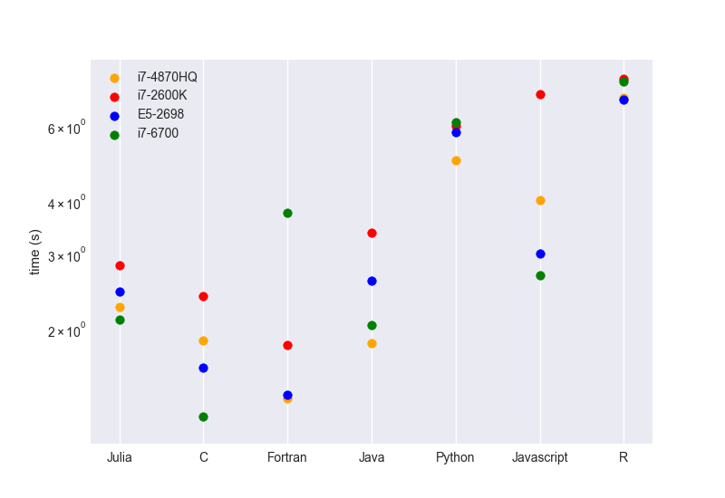

# Benchmark for different languages
Performace comparison between C, C++, modern Fortran (F95), Java, Javascript,
[Julia](https://julialang.org/), Python, R
Python implementation uses numpy and vectorization.

<!--
On Intel(R) Core(TM) i7-2600k CPU, the running time is listed below
```
C: 5.014 s
Fortran: 3.405 s
Julia: 5.860 s
Python: 62.517 s
```

On Intel(R) Xeon(R) CPU E5-2698 V4, the running time is listed below
```
C: 3.012 s
Fortran: 2.632 s
Julia: 4.887 s
Python: 55.174 s
```

On Intel(R) Core(TM) i7-6700 CPU, the running time is listed below
```
C: 2.403 s
Fortran: 13.615 s
Julia: 4.032 s
Python: 60.159 s
```
-->

The benchmark is shown in below figure.



