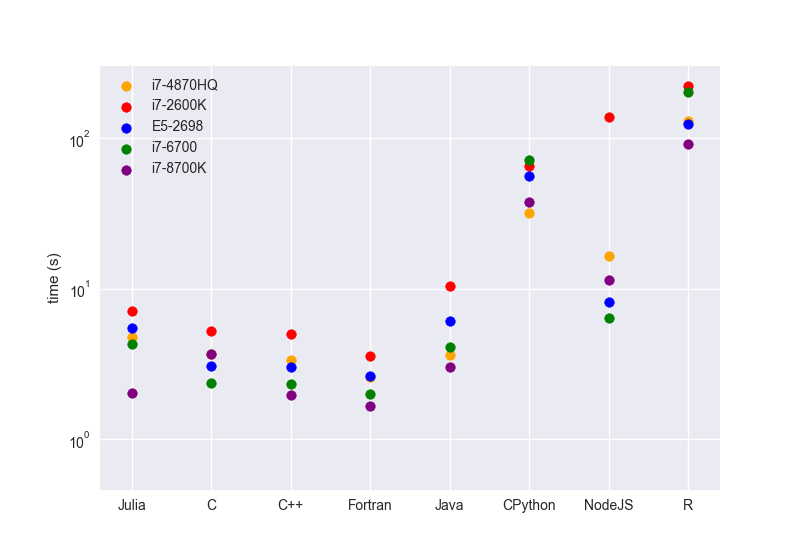

# Benchmark for different languages
Performace comparison between C, C++, modern Fortran (F95), Java, Javascript, [Julia](https://julialang.org/), Python,  and R. 

Python implementation uses numpy and vectorization. R implementation is also vectorized. 

<!--
On Intel(R) Core(TM) i7-2600k CPU, the running time is listed below
```
C: 5.014 s
Fortran: 3.405 s
Julia: 5.860 s
Python: 62.517 s
```

On Intel(R) Xeon(R) CPU E5-2698 V4, the running time is listed below
```
C: 3.012 s
Fortran: 2.632 s
Julia: 4.887 s
Python: 55.174 s
```

On Intel(R) Core(TM) i7-6700 CPU, the running time is listed below
```
C: 2.403 s
Fortran: 13.615 s
Julia: 4.032 s
Python: 60.159 s
```
-->

The benchmark is shown below.



The compiler or interpreter versions are listed below

I. E5-2698 platform (Fedora 24)

1. Julia: 0.6.2
2. C: GCC 6.3.1
3. Fortran: GCC 6.3.1
4. Java: JDK 1.8.0
5. Python: 3.6.3
6. Javascript: nodejs 8.2.1
7. R: 3.4.1

II. i7-6700 platform (Ubuntu 16)

1. Julia: 0.6.2
2. C: GCC 6.3.0
3. Fortran: GFortran 5.4.1
4. Java: JDK 1.8.0
5. Python: 3.6.3
6. Javascript: nodejs 4.2.6
7. R: 3.2.3

III. E5-2600K platform (Ubuntu 16)

1. Julia: 0.6.2
2. C: GCC 6.3.0
3. Fortran: GFortran 5.4.1
4. Java: JDK 1.8.0
5. Python: 3.6.3
6. Javascript: nodejs 8.11.1
7. R: 3.2.3

IV. i7-4870HQ (OS X 10.13.4)

1. Julia: 0.6.1
2. C: Clang-902.0.39.1
3. Fortran: GFortran 6.3.0
4. Java: Java 10 (JRE 18.3)
5. Python: 3.6.3
6. Javascript: nodejs 8.11.1
7. R: 3.4.3


